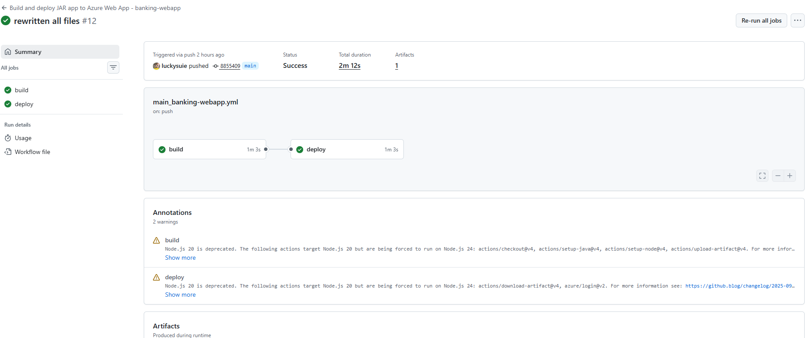
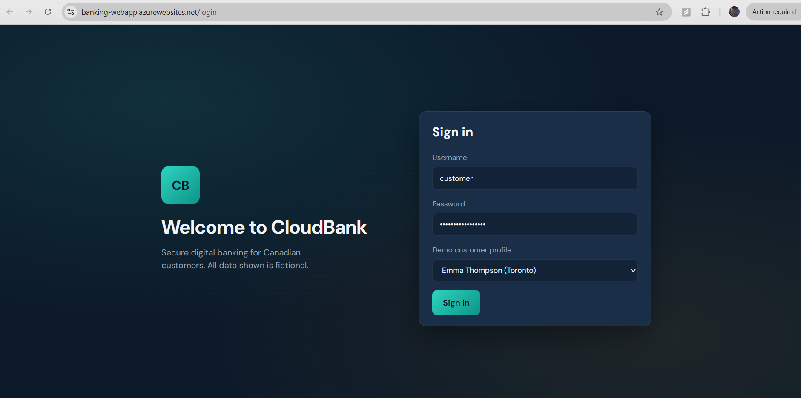
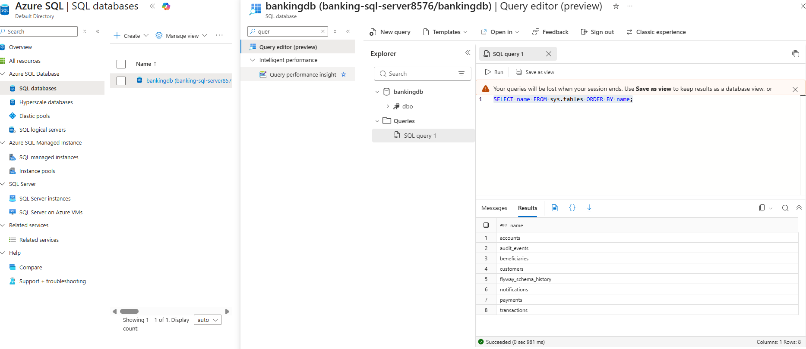

# Azure Full Stack Digital Banking Platform with CI/CD
## End-to-End Deployment using React, Spring Boot, Azure App Service, Azure SQL Database, Azure Key Vault, Managed Identity, and GitHub Actions
### Steps
0. Fork the repository to your Github account. Repo URL : https://github.com/luckysuie/banking
- Note: while using hte commands paste one after another 
### Login to Azure portal and open the Cloud Shell then run the following commands to create the required resources in Azure.
```bash
az group create --name banking-rg --location CentralIndia
az sql server create --name banking-sql-server8576 --resource-group banking-rg --location CentralIndia --admin-user adminuser --admin-password AdminPassword123!
az sql db create --resource-group banking-rg --server banking-sql-server8576 --name bankingdb --service-objective S0
az sql server firewall-rule create --resource-group banking-rg --server banking-sql-server8576 --name AllowYourIP --start-ip-address 49.43.216.247 --end-ip-address 49.43.216.247 ## change the IP adress here to your IP address
az sql server firewall-rule create --resource-group banking-rg --server banking-sql-server8576 --name AllowAzureServices --start-ip-address 0.0.0.0 --end-ip-address 0.0.0.0
```

### create an Azure keyvault 
```bash
az keyvault create --name banking-kv --resource-group banking-rg --location CentralIndia
```
### Keyvault name check
1. Navigate to your forked repo and go to banking/digital-banking-platform/src/main/resources/application-azure.yml
2. On the 20th line ensure you have same keyvault name if not change it and commit


## Assign Key Vault Administrator role to the signed-in user for the Key Vault
```bash
USER_OBJECT_ID=$(az ad signed-in-user show --query id -o tsv)
KV_ID=$(az keyvault show --name banking-kv --resource-group banking-rg --query id -o tsv)
az role assignment create --assignee $USER_OBJECT_ID --role "Key Vault Administrator" --scope $KV_ID
```

## Store the database connection string, username, and password as secrets in Azure Key Vault
```bash
az keyvault secret set --vault-name banking-kv --name "sql-jdbc-url" --value "jdbc:sqlserver://banking-sql-server8576.database.windows.net:1433;database=bankingdb;encrypt=true;trustServerCertificate=false;hostNameInCertificate=*.database.windows.net;loginTimeout=30;"
az keyvault secret set --vault-name banking-kv --name "sql-admin-username" --value "adminuser"
az keyvault secret set --vault-name banking-kv --name "sql-admin-password" --value "AdminPassword123!"
```

### create app service plan and web app
```bash
az appservice plan create --name banking-app-service-plan --resource-group banking-rg --sku B1 --is-linux
az webapp create --name banking-webapp --resource-group banking-rg --plan banking-app-service-plan --runtime "JAVA|11-java11"
az webapp config set --name banking-webapp --resource-group banking-rg --linux-fx-version "JAVA|21-java21"
```

#### This command configures your deployed Spring Boot application to run using Azure-specific settings and tells it which Azure Key Vault to use.
```bash
az webapp config appsettings set --name banking-webapp --resource-group banking-rg --settings AZURE_KEYVAULT_ENDPOINT=https://banking-kv.vault.azure.net/ SPRING_PROFILES_ACTIVE=azure
```

#### This command sets the APP_DATA_INITIALIZE environment variable to true in the Azure App Service, enabling the application to perform initial data seeding (such as creating default users, roles, or sample data) when it starts.
```bash
az webapp config appsettings set --name banking-webapp --resource-group banking-rg --settings APP_DATA_INITIALIZE=true
```

#### This command enables a System Assigned Managed Identity for the Azure App Service, allowing it to securely authenticate with Azure services like Key Vault without storing credentials.
```bash
az webapp identity assign --name banking-webapp --resource-group banking-rg 
```

#### Assign the Key Vault Secrets User role to the web app's managed identity for accessing secrets in Key Vault
```bash
APP_PRINCIPAL_ID=$(az webapp show --name banking-webapp --resource-group banking-rg --query identity.principalId -o tsv)
KV_ID=$(az keyvault show --name banking-kv --resource-group banking-rg --query id -o tsv)
az role assignment create --assignee-object-id $APP_PRINCIPAL_ID --assignee-principal-type ServicePrincipal --role "Key Vault Secrets User" --scope $KV_ID
```

1. Navigate to your webapp and on the left blade type deployment center then follow the below process
    - Source: Github
    - Signed in as: here your account should sign if not please sign in to your Github
    - Organization: your organization name
    - Repository: your forked banked repository
    - Branch: main
    - Workflow option: select first one (Add a workflow: Add a new workflow file)
    - Authentication settings
        - Authentication type: user-assigned--identity
        - subscription: your subscription
        - Identity: new it will show automatically no need to change this 
    - Finally on the top save

2. Navigate to your repository and do the following
    - click on .github/workflows folder
    - click on the yml file which is shown for you
    - on the top right corner click on the edit(pencil symbol) and replace the **BUILD section** with below
```bash

name: Build and deploy JAR app to Azure Web App - banking-webapp

on:
  push:
    branches:
      - main
  workflow_dispatch:

jobs:
  build:
    runs-on: ubuntu-latest
    permissions:
      contents: read #This is required for actions/checkout

    steps:
      - uses: actions/checkout@v4

      - name: Set up Node.js version
        uses: actions/setup-node@v4
        with:
          node-version: '20'
          cache: 'npm'
          cache-dependency-path: digital-banking-web/package-lock.json

      - name: Install frontend dependencies
        run: |
          cd digital-banking-web
          npm install

      - name: Build React frontend
        run: |
          cd digital-banking-web
          npm run build

      - name: Copy frontend build into Spring Boot static resources
        run: |
          rm -rf digital-banking-platform/src/main/resources/static
          mkdir -p digital-banking-platform/src/main/resources/static
          cp -r digital-banking-web/dist/. digital-banking-platform/src/main/resources/static/

      - name: Set up Java version
        uses: actions/setup-java@v4
        with:
          java-version: '21'
          distribution: 'microsoft'

      - name: Run backend tests
        run: |
          cd digital-banking-platform
          mvn -B test

      - name: Package Spring Boot JAR (with bundled frontend)
        run: |
          cd digital-banking-platform
          mvn -B clean package -DskipTests

      - name: Upload artifact for deployment job
        uses: actions/upload-artifact@v4
        with:
          name: java-app
          path: digital-banking-platform/target/*.jar
```

 - IMP: DONT CHANGE THE DEPLOY SECTION
 - Commit the changes to the main branch

3. Workflow checking
    - Click on the github actions buttion on your repository
    - Click on the current running workflow
    - you should see build and deploy running and after sometime it should be succesfull

### workflow succesfull 
    
### website login
    
### Azure sql database
    
    
4. Run SQL queries to verify the database and tables
 - navigate to your Azure Sql database
 - on the left blade type Query editor and selct it
 - Login into you database by giving your usename and Password and run below queries
```bash
SELECT name FROM sys.tables ORDER BY name;
SELECT * FROM customers;
SELECT * FROM accounts;
SELECT * FROM beneficiaries;
SELECT * FROM payments;
SELECT * FROM transactions;
SELECT * FROM notifications;
SELECT * FROM audit_events;
SELECT * FROM flyway_schema_history;
```

