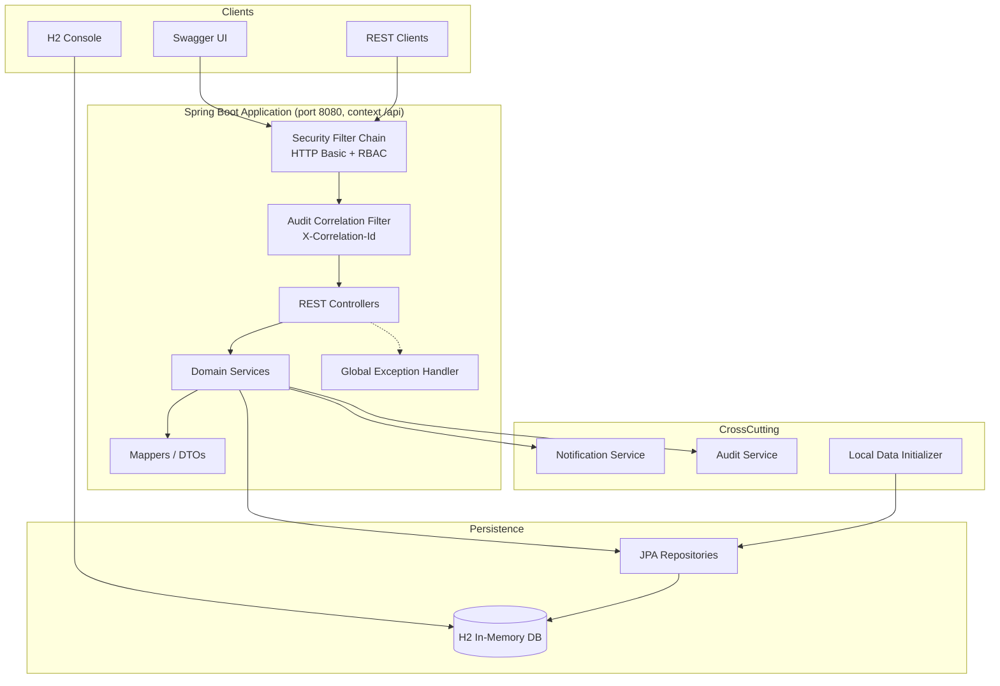
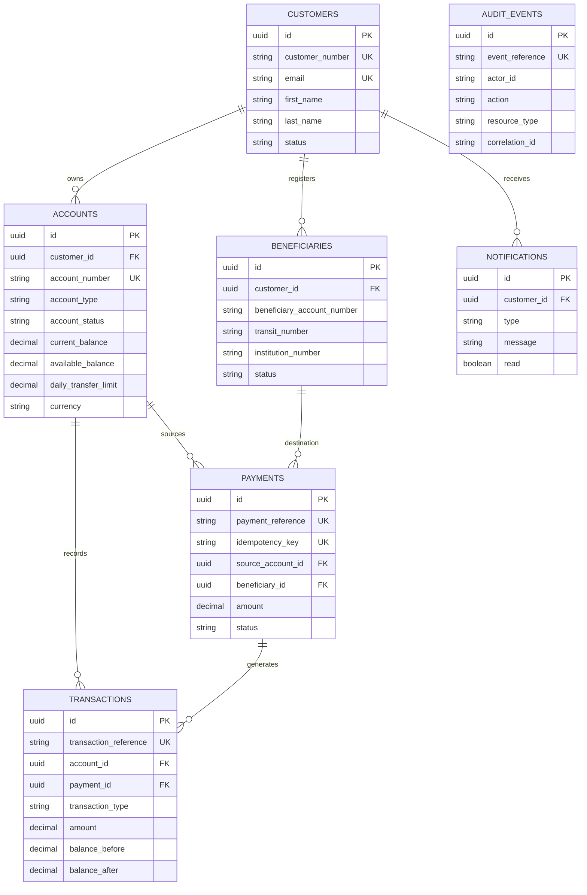

# CloudBank Digital Banking Platform

A modular Spring Boot application that demonstrates core retail banking capabilities for Canadian customers. The platform provides REST APIs for customer onboarding, account management, beneficiary setup, fund transfers, transaction history, notifications, and audit logging.

> **Fictional data only** — All customer names, addresses, email addresses, account numbers, and financial balances in this project are entirely fictional. No real personal or banking information is used.

---

## Project Overview

CloudBank Digital Banking Platform is a **local development and learning reference** for building a digital banking backend. It implements common banking workflows—customer registration, chequing and savings accounts, domestic transfers, ledger entries, and operational notifications—using a layered, modular monolith architecture.

The application is intended for:

- Exploring Spring Boot banking API design patterns
- Demonstrating transactional fund transfers with idempotency
- Prototyping integration with future Azure identity and data services

---

## Business Problem

Retail banks need reliable digital channels that let customers:

- Open and manage accounts
- Register trusted payees (beneficiaries)
- Transfer funds safely with balance and limit checks
- Review transaction history
- Receive timely payment notifications

Building these capabilities requires careful handling of **data integrity**, **concurrency**, **auditability**, and **security**. This project models those concerns in a simplified, self-contained environment suitable for development and demonstration.

---

## Current Application Scope

| In scope | Out of scope |
|----------|--------------|
| Customer CRUD and status management | Production-grade identity federation |
| Chequing and savings accounts (CAD) | Card payments and ATM networks |
| Beneficiary management with Canadian routing fields | External payment rails (Interac e-Transfer, wire SWIFT) |
| Internal and external fund transfers | Regulatory reporting (FINTRAC, OSFI submissions) |
| Transaction history (read-only) | Multi-currency FX trading |
| In-app notifications (console + API) | Email/SMS delivery providers |
| Audit event logging | Fraud detection and AML screening |
| HTTP Basic auth with role-based access | Production-grade identity federation |
| H2 in-memory database with demo seed data | Persistent production database |
| React customer portal (`digital-banking-web`) | Admin operations console |

---

## Features

- **Customer management** — Register and update customers with Canadian address validation
- **Account management** — Open chequing/savings accounts, query balances, admin status changes
- **Beneficiary management** — Add, update, and remove payees with transit/institution validation
- **Fund transfers** — Atomic debit/credit with balance checks, daily limits, and idempotency keys
- **Transaction ledger** — Immutable debit/credit records with before/after balances
- **Notifications** — Auto-generated events for account creation, beneficiaries, and payments
- **Audit trail** — Searchable audit log with correlation ID support
- **API documentation** — Interactive Swagger UI with HTTP Basic auth
- **Demo data initializer** — Idempotent seeding of fictional Canadian banking data on startup
- **Structured error responses** — Consistent JSON errors with correlation IDs

---

## Technology Stack

| Layer | Technology |
|-------|------------|
| Language | Java 21 |
| Framework | Spring Boot 3.4.1 |
| Build | Maven |
| Persistence | Spring Data JPA, Hibernate |
| Database | H2 (in-memory, local development) |
| Security | Spring Security, HTTP Basic, BCrypt |
| Validation | Jakarta Bean Validation |
| API docs | Springdoc OpenAPI 2.8.3 |
| Utilities | Lombok |
| Testing | JUnit 5, Mockito, Spring Boot Test, MockMvc |

---

## Application Modules

The codebase is organized as a modular monolith under `com.cloudbank.digitalbanking`:

| Module | Responsibility |
|--------|----------------|
| `customer` | Customer registration, profile updates, status |
| `account` | Account opening, balance queries, status management |
| `beneficiary` | Payee registration and lifecycle |
| `payment` | Fund transfer processing with idempotency |
| `transaction` | Read-only transaction history APIs |
| `notification` | Customer notification persistence and delivery |
| `audit` | Immutable audit event recording and search |
| `common` | Shared DTOs, constants, utilities, base entity |
| `config` | Security, OpenAPI, JPA, correlation filter, demo data |
| `security` | JSON authentication and access-denied handlers |
| `exception` | Global exception handling and error codes |

---

## Local Architecture



**Request flow:** Clients authenticate via HTTP Basic → correlation ID is assigned → controller validates input → service executes business logic within a transaction → repositories persist changes → notifications and audit events are recorded → a standardized `ApiResponse` is returned.

---

## Database Design

Hibernate manages schema creation (`ddl-auto: update`). Entities use UUID primary keys, audit timestamps, and optimistic locking (`@Version`). Relationships are stored as UUID references (no JPA associations).

### Entity Relationship Overview



### Reference Prefixes

| Entity | Prefix | Example |
|--------|--------|---------|
| Customer | `CUS-` | `CUS-DEMO000001` |
| Account | `CB` | `CB1001001001` |
| Payment | `PAY-` | `PAY-A1B2C3D4E5F6` |
| Transaction | `TXN-` | `TXN-A1B2C3D4E5F6` |
| Audit event | `AUD-` | `AUD-DEMO000001` |

---

## REST API Summary

Base URL: `http://localhost:8080/api`

All authenticated endpoints require **HTTP Basic** authentication. Responses use the `ApiResponse<T>` wrapper; errors return structured `ErrorResponse` or `ValidationErrorResponse`.

| Module | Method | Endpoint | Auth | Description |
|--------|--------|----------|------|-------------|
| Customer | `POST` | `/customers` | Customer+ | Create customer |
| Customer | `GET` | `/customers` | **Admin** | List all customers |
| Customer | `GET` | `/customers/{id}` | Customer+ | Get customer by ID |
| Customer | `GET` | `/customers/customer-number/{no}` | Customer+ | Get by customer number |
| Customer | `PUT` | `/customers/{id}` | Customer+ | Update customer |
| Customer | `PATCH` | `/customers/{id}/status` | Customer+ | Update status |
| Account | `POST` | `/accounts` | Customer+ | Open account |
| Account | `GET` | `/accounts/{id}` | Customer+ | Get account |
| Account | `GET` | `/accounts/customer/{customerId}` | Customer+ | List customer accounts |
| Account | `GET` | `/accounts/{id}/balance` | Customer+ | Get balance |
| Account | `PATCH` | `/accounts/{id}/status` | **Admin** | Change account status |
| Beneficiary | `POST` | `/beneficiaries` | Customer+ | Add beneficiary |
| Beneficiary | `GET` | `/beneficiaries/customer/{customerId}` | Customer+ | List beneficiaries |
| Beneficiary | `PUT/PATCH/DELETE` | `/beneficiaries/{id}` | Customer+ | Manage beneficiary |
| Payment | `POST` | `/payments/transfers` | Customer+ | Process fund transfer |
| Payment | `GET` | `/payments/customer/{customerId}` | Customer+ | List payments |
| Transaction | `GET` | `/transactions/account/{accountId}` | Customer+ | Transaction history |
| Notification | `GET` | `/notifications/customer/{customerId}` | Customer+ | List notifications |
| Notification | `PATCH` | `/notifications/{id}/read` | Customer+ | Mark as read |
| Audit | `GET` | `/audit-events` | **Admin** | Search audit events |

---

## Prerequisites

- **JDK 21** or later
- **Maven 3.9+**
- A terminal and REST client (curl, Postman, or Swagger UI)

---

## Environment Variables

| Variable | Default | Description |
|----------|---------|-------------|
| `APP_SECURITY_CUSTOMER_USERNAME` | `customer` | HTTP Basic username for customer role |
| `APP_SECURITY_CUSTOMER_PASSWORD` | `changeme-customer` | HTTP Basic password for customer role |
| `APP_SECURITY_ADMIN_USERNAME` | `admin` | HTTP Basic username for admin role |
| `APP_SECURITY_ADMIN_PASSWORD` | `changeme-admin` | HTTP Basic password for admin role |
| `APP_DATA_INITIALIZE` | `true` | Seed fictional demo data on startup (`false` to disable) |

### Example (PowerShell)

```powershell
$env:APP_SECURITY_CUSTOMER_PASSWORD = "my-local-customer-secret"
$env:APP_SECURITY_ADMIN_PASSWORD = "my-local-admin-secret"
$env:APP_DATA_INITIALIZE = "true"
```

### Example (bash)

```bash
export APP_SECURITY_CUSTOMER_PASSWORD=my-local-customer-secret
export APP_SECURITY_ADMIN_PASSWORD=my-local-admin-secret
export APP_DATA_INITIALIZE=true
```

> Override default passwords before deploying outside a local workstation. The application logs a warning at startup when insecure defaults are detected.

---

## Build the Application

```bash
cd digital-banking-platform
mvn clean package
```

Skip tests during packaging:

```bash
mvn clean package -DskipTests
```

---

## Run the Application

```bash
mvn spring-boot:run
```

Or run the packaged JAR:

```bash
java -jar target/digital-banking-platform-0.0.1-SNAPSHOT.jar
```

The API starts at **http://localhost:8080/api**.

On first startup, the demo data initializer seeds three fictional Canadian customers (when `APP_DATA_INITIALIZE=true` and data is not already present).

---

## Customer Portal (React UI)

A customer-facing web app lives in the sibling folder `digital-banking-web`. Start the API first, then:

```powershell
$env:Path = "C:\tools\nodejs;" + $env:Path
cd digital-banking-web
npm install
npm run dev
```

| Resource | URL |
|----------|-----|
| Customer portal | http://localhost:5173 |
| Demo login | `customer` / `changeme-customer` |

See `digital-banking-web/README.md` for full UI documentation.

---

## Run Tests

```bash
mvn test
```

The test suite includes:

- **Unit tests** — Service-layer logic with Mockito
- **Integration tests** — Full Spring context with MockMvc and H2
- **Security tests** — Authentication and authorization behaviour

---

## Swagger UI

| Resource | URL |
|----------|-----|
| Swagger UI | http://localhost:8080/api/swagger-ui.html |
| OpenAPI JSON | http://localhost:8080/api/v3/api-docs |

Click **Authorize** in Swagger and enter HTTP Basic credentials.

---

## H2 Console

| Setting | Value |
|---------|-------|
| URL | http://localhost:8080/api/h2-console |
| JDBC URL | `jdbc:h2:mem:digitalbanking` |
| Username | `sa` |
| Password | *(leave empty)* |

---

## Demo Users

| Username | Password (default) | Roles | Typical use |
|----------|-------------------|-------|-------------|
| `customer` | `changeme-customer` | `ROLE_CUSTOMER` | Day-to-day banking APIs |
| `admin` | `changeme-admin` | `ROLE_ADMIN`, `ROLE_CUSTOMER` | Audit logs, list customers, account status |

### Seeded Demo Customers

| Customer number | Name | Email |
|-----------------|------|-------|
| `CUS-DEMO000001` | Emma Thompson | `emma.thompson@fictional-mail.demo` |
| `CUS-DEMO000002` | Noah Tremblay | `noah.tremblay@fictional-mail.demo` |
| `CUS-DEMO000003` | Priya Singh | `priya.singh@fictional-mail.demo` |

Retrieve a customer's UUID via `GET /customers/customer-number/CUS-DEMO000001` (admin) or the H2 console.

---

## Sample API Requests

### Create a customer

```bash
curl -u customer:changeme-customer \
  -X POST http://localhost:8080/api/customers \
  -H "Content-Type: application/json" \
  -H "X-Correlation-Id: demo-request-001" \
  -d '{
    "firstName": "Alex",
    "lastName": "Mercier",
    "email": "alex.mercier@fictional-mail.demo",
    "phoneNumber": "+14165559001",
    "dateOfBirth": "1991-04-18",
    "addressLine1": "42 Demo Street",
    "city": "Ottawa",
    "province": "Ontario",
    "postalCode": "K1A0B1"
  }'
```

### Open a chequing account

```bash
curl -u customer:changeme-customer \
  -X POST http://localhost:8080/api/accounts \
  -H "Content-Type: application/json" \
  -d '{
    "customerId": "<customer-uuid>",
    "accountType": "CHEQUING"
  }'
```

### Add a beneficiary

```bash
curl -u customer:changeme-customer \
  -X POST http://localhost:8080/api/beneficiaries \
  -H "Content-Type: application/json" \
  -d '{
    "customerId": "<customer-uuid>",
    "beneficiaryName": "Jordan Park",
    "beneficiaryAccountNumber": "9001234567",
    "bankName": "Fictional Canadian Bank",
    "transitNumber": "12345",
    "institutionNumber": "001",
    "nickname": "Jordan"
  }'
```

### Process a fund transfer

```bash
curl -u customer:changeme-customer \
  -X POST http://localhost:8080/api/payments/transfers \
  -H "Content-Type: application/json" \
  -d '{
    "sourceAccountId": "<account-uuid>",
    "beneficiaryId": "<beneficiary-uuid>",
    "amount": 150.00,
    "description": "Demo rent payment",
    "idempotencyKey": "transfer-demo-001"
  }'
```

### Search audit events (admin)

```bash
curl -u admin:changeme-admin \
  "http://localhost:8080/api/audit-events?action=CUSTOMER_CREATED&page=0&size=10"
```

---

## Known Limitations

This is a **development demonstration** and has intentional gaps:

- **Not production-ready** — No high-availability, clustering, or operational runbooks
- **In-memory database** — Data is lost when the process stops (H2)
- **HTTP Basic authentication** — In-memory users; no OAuth2/OIDC integration yet
- **No resource ownership enforcement** — Authenticated users can access any UUID; production would map principals to customers
- **Simplified security model** — H2 console and Swagger are publicly accessible in local configuration
- **No external payment settlement** — External beneficiary transfers record a debit only; no third-party clearing
- **Console-only notification delivery** — Notifications are persisted and printed to stdout, not emailed or pushed
- **UUID references without FK constraints** — Orphaned references are possible if entities are removed
- **Single-region, single-instance** — No geo-redundancy or distributed transaction coordination

---

## Microsoft Azure Deployment

The platform now supports a production **`azure`** Spring profile with full infrastructure-as-code.

| Component | Azure Service |
|-----------|---------------|
| Database | Azure SQL Database + Flyway migrations |
| Secrets | Azure Key Vault (managed identity) |
| Authentication | Microsoft Entra ID (JWT bearer tokens) |
| API hosting | Azure App Service (Java 21) |
| Web hosting | Azure App Service (Node 22) |
| Entry point | Azure Front Door + CDN + WAF |
| Load balancing | Application Gateway |
| Networking | VNet, subnets, Azure Firewall |
| VM access | Azure Bastion |
| DR | Site Recovery vault |
| Monitoring | Application Insights + Log Analytics |

**Deploy infrastructure:**

```bash
cd infrastructure/azure
# Edit main.parameters.json with your Entra IDs
./scripts/deploy.ps1 -ResourceGroup rg-cloudbank-prod
```

**Run API on Azure:** set `SPRING_PROFILES_ACTIVE=azure` on App Service.

See [`infrastructure/azure/README.md`](../infrastructure/azure/README.md) for the complete deployment guide, Entra ID app registration steps, and SQL admin script.

---

## Security Disclaimer

- Default credentials (`changeme-customer`, `changeme-admin`) are for **local development only**.
- Do not expose this application to the public internet without hardening authentication, transport security (TLS), and network controls.
- This software has **not** undergone penetration testing, threat modelling, or formal security review.
- This software is **not** bank-certified, **not** production-ready, and **not** OSFI-compliant.
- Use at your own risk in non-production environments.

---

## Fictional Data Statement

All persons, organizations, addresses, email domains (`@fictional-mail.demo`), phone numbers, account numbers, balances, and transaction descriptions in this project are **entirely fictional** and created for demonstration purposes. They do not represent real individuals, institutions, or financial accounts.

---

## License

Internal demonstration project — refer to your organization's licensing policy.
